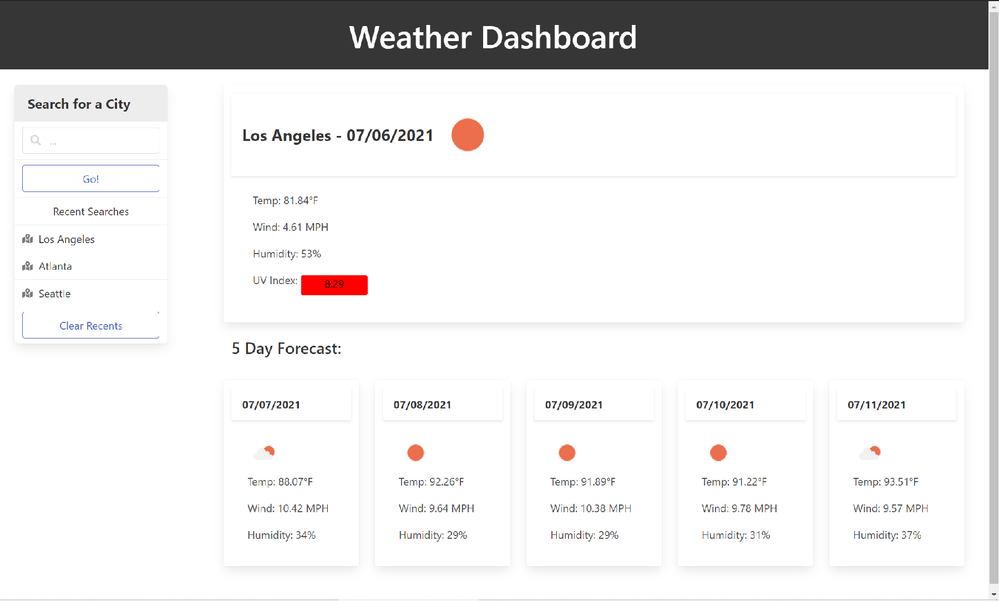

# weather-dashboard

### Deployed Link: [https://kkolyvek.github.io/weather-dashboard/](https://kkolyvek.github.io/weather-dashboard/)

### Brief Description:

This site allows the user to input a city and view the current forecast + 5 additional days.

### How it Works:

The site makes use of the Open Weather API to retrieve forecast information. Two calls are made to the API per search; one to query the latitude and longitude of an inputted city, and one to retrieve the weather data of the city in question. Upon completion, the cards to the right of the page are populated with retrieved data. Weather icons are also provided by the Open Weather API.

Additionally, Bulma.io is used to style the site and moment.js is used to format dates.

### Site Preview:

